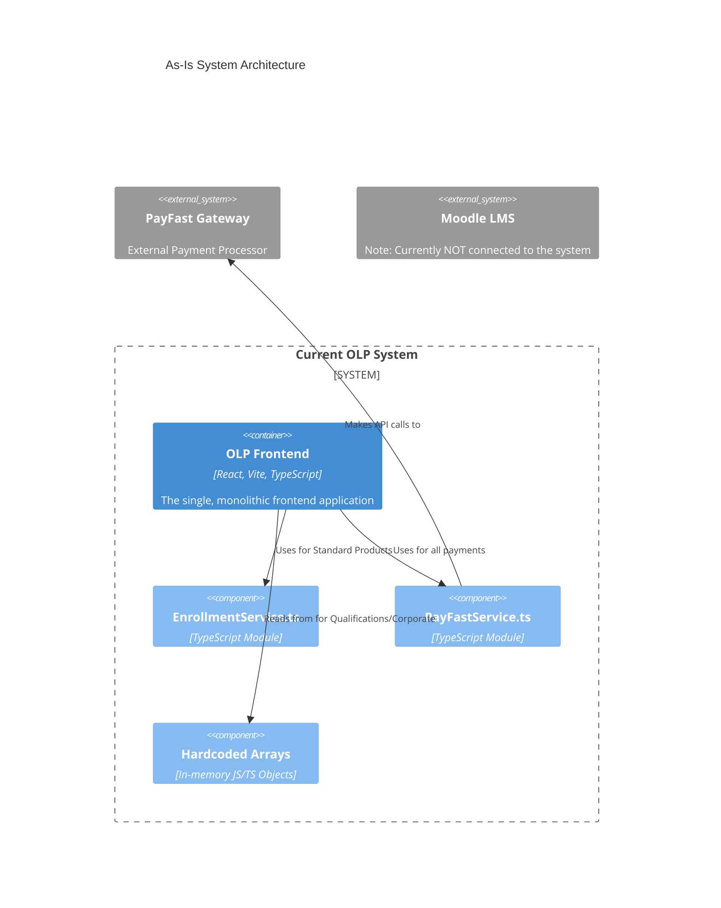
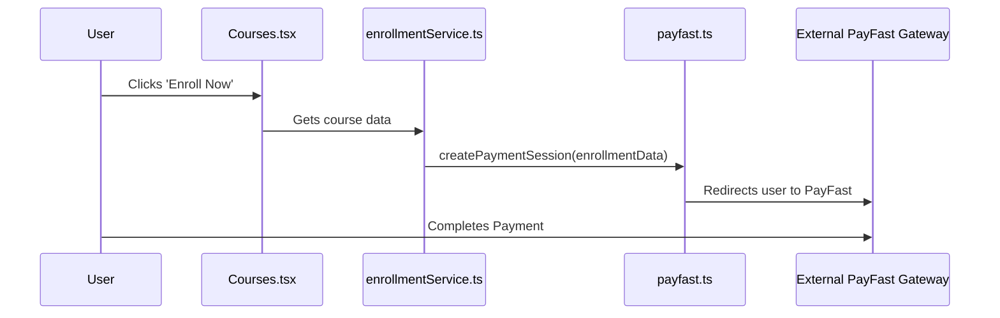
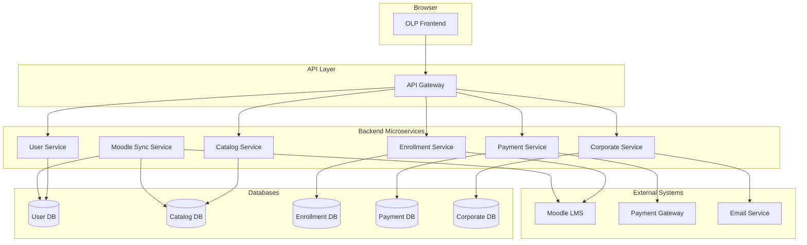
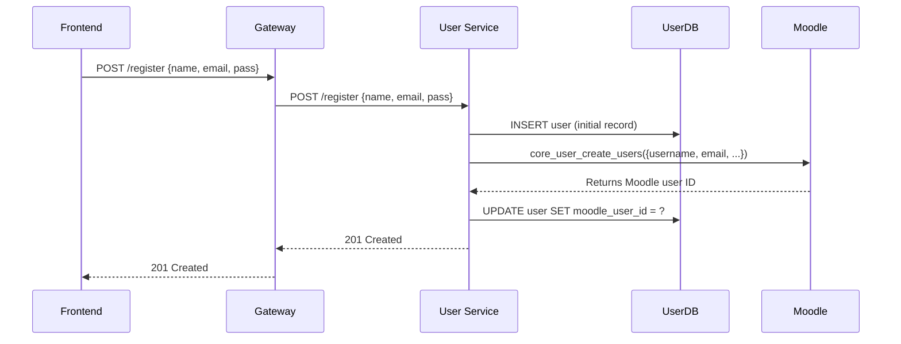
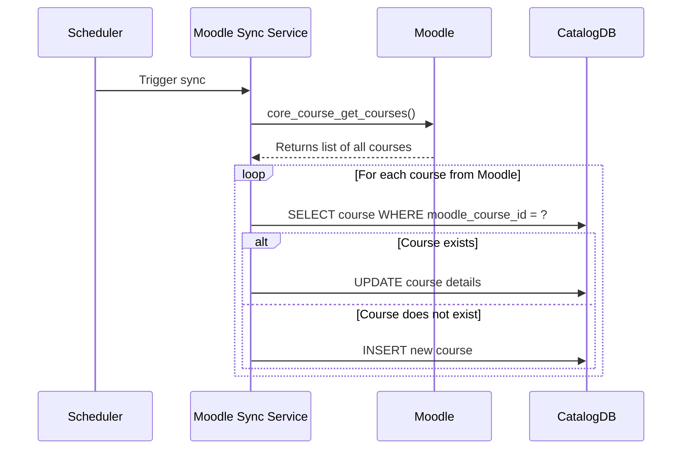

# Open Learning Platform (OLP) - Project Architecture

**Version:** 2.2
**Date:** 2025-09-12

## 1. Introduction & Project Overview

This document outlines the evolution of the Open Learning Platform (OLP) from its current state to a future-proof, scalable system. It is divided into two main parts:

1.  **As-Is Architecture Analysis:** A detailed documentation of the current, existing system.
2.  **To-Be Proposed Architecture:** A comprehensive proposal for a new **Microservice Architecture**, with a dedicated section detailing the Moodle integration strategy.

---

## PART I: AS-IS ARCHITECTURE ANALYSIS

### 2. Current System Analysis

The existing OLP is a frontend application with three distinct business verticals:

*   **Standard Products (Courses, Masterclasses, Programmes):** B2C transactional products.
*   **Qualifications:** High-value, formal B2C educational products.
*   **Corporate Training:** B2B lead-generation service.

### 3. As-Is Architecture & Data Flow

The current system is a **frontend-only application** built with React (using Vite). It does not have a dedicated backend API. All business logic and data are handled within the frontend code.

**Crucially, the current system has no integration with Moodle.** All data is either hardcoded within the application or stored ephemerally in frontend services. This lack of a central backend and Moodle integration is the primary problem the new architecture must solve.

#### 3.1. As-Is Architecture Diagram

This diagram illustrates the current architecture and its lack of connection to a Moodle backend.



#### 3.2. As-Is Data Flow Diagrams

The data flows are contained entirely within the frontend or go out to the payment gateway.

**As-Is Flow: Enrolling in a Standard Product**



---

## PART II: TO-BE PROPOSED ARCHITECTURE

### 4. Proposed High-Level System Architecture: Microservices

A new **Microservice Architecture** is proposed to create a robust, scalable, and maintainable backend system that fully integrates with Moodle.

#### 4.1. Proposed Microservice Architecture Diagram



### 5. Detailed Moodle Integration Strategy

This section details how the proposed microservices will interact directly with the Moodle LMS.

#### 5.1. User Service: User Creation & Synchronization
*   **Responsibility:** The User Service is responsible for creating users in both the OLP system and Moodle simultaneously to ensure they are always in sync.
*   **Flow:** When a new user registers, the User Service will perform a two-step creation process.

**Sequence Diagram: New User Registration**


#### 5.2. Enrollment Service: Real-time Course Enrollment
*   **Responsibility:** After a payment is confirmed, the Enrollment Service is responsible for enrolling the user into the correct course on Moodle in real-time.
*   **Flow:** This is triggered by an internal call from the Payment Service. The service uses the `moodle_user_id` (retrieved from the User Service) and the `moodle_course_id` (from the Catalog Service) to make the API call.
*   **Moodle Endpoint:** `enrol_manual_enrol_users`
*   **Error Handling:** If the Moodle API call fails, the enrollment status will be marked as 'FAILED' in the EnrollmentDB, and a notification will be sent to an administrator to manually resolve the issue.

#### 5.3. Moodle Sync Service: Catalog & Progress Synchronization
*   **Responsibility:** This is a background service that runs periodically (e.g., every hour) to keep the OLP's local database in sync with Moodle, which is the source of truth for course content and progress.
*   **Flow for Catalog Sync:**
    1.  Fetch all courses from Moodle using `core_course_get_courses`.
    2.  Compare with records in the OLP's `CatalogDB`.
    3.  Insert new courses, update existing ones, and disable any that are no longer in Moodle.

**Sequence Diagram: Catalog Synchronization**


### 6. Detailed Service Design & API Specification

This section provides a detailed, low-level design for each microservice, including its responsibilities, database schema, and API contract.

#### 6.1. User Service

*   **Responsibilities:**
    *   Manages the full lifecycle of a user account.
    *   Handles user registration, creating records in both the OLP and Moodle.
    *   Handles user authentication (login) and issues JSON Web Tokens (JWTs).
    *   Provides endpoints for retrieving user profile information.

*   **Database Schema (`UserDB` - PostgreSQL):**
    ```sql
    CREATE TABLE "users" (
      "id" SERIAL PRIMARY KEY,
      "moodle_user_id" INTEGER UNIQUE,
      "name" VARCHAR(255) NOT NULL,
      "email" VARCHAR(255) UNIQUE NOT NULL,
      "password_hash" VARCHAR(255) NOT NULL,
      "created_at" TIMESTAMP WITH TIME ZONE DEFAULT CURRENT_TIMESTAMP,
      "updated_at" TIMESTAMP WITH TIME ZONE DEFAULT CURRENT_TIMESTAMP
    );
    CREATE INDEX "idx_users_email" ON "users" ("email");
    ```

*   **API Endpoints:**
    *   **`POST /register`**
        *   **Description:** Creates a new user in the OLP and Moodle.
        *   **Request Body:** `{ "name": "John Doe", "email": "john.doe@example.com", "password": "strongpassword123" }`
        *   **Success Response (201):** `{ "id": 1, "name": "John Doe", "email": "john.doe@example.com", "moodle_user_id": 101 }`
        *   **Error Response (409):** `{ "error": "User with this email already exists." }`
    *   **`POST /login`**
        *   **Description:** Authenticates a user and returns a JWT for accessing protected routes.
        *   **Request Body:** `{ "email": "john.doe@example.com", "password": "strongpassword123" }`
        *   **Success Response (200):** `{ "accessToken": "ey..." }`
        *   **Error Response (401):** `{ "error": "Invalid credentials." }`

#### 6.2. Catalog Service

*   **Responsibilities:**
    *   Provides a comprehensive, queryable catalog of all learning products.
    *   Stores and serves data for Standard Products and Qualifications.
    *   Data is populated and kept in sync by the Moodle Sync Service.

*   **Database Schema (`CatalogDB` - PostgreSQL):**
    ```sql
    CREATE TABLE "products" (
      "id" SERIAL PRIMARY KEY,
      "moodle_course_id" INTEGER UNIQUE NOT NULL,
      "name" VARCHAR(255) NOT NULL,
      "description" TEXT,
      "product_type" VARCHAR(50) NOT NULL, -- 'COURSE', 'MASTERCLASS', 'PROGRAMME'
      "price" DECIMAL(10, 2) NOT NULL,
      "currency" VARCHAR(3) NOT NULL DEFAULT 'ZAR',
      "is_active" BOOLEAN DEFAULT true
    );

    CREATE TABLE "qualifications" (
      "id" SERIAL PRIMARY KEY,
      "moodle_program_id" INTEGER UNIQUE NOT NULL,
      "title" VARCHAR(255) NOT NULL,
      "description" TEXT,
      "nqf_level" VARCHAR(50),
      "credits" INTEGER,
      "price" DECIMAL(10, 2) NOT NULL,
      "currency" VARCHAR(3) NOT NULL DEFAULT 'ZAR',
      "is_active" BOOLEAN DEFAULT true
    );
    ```

*   **API Endpoints:**
    *   **`GET /products`**: Returns a paginated list of all active standard products.
    *   **`GET /products/{id}`**: Returns a single product by its ID.
    *   **`GET /qualifications`**: Returns a paginated list of all active qualifications.
    *   **`GET /qualifications/{id}`**: Returns a single qualification by its ID.

#### 6.3. Enrollment Service

*   **Responsibilities:**
    *   Creates and manages enrollment records.
    *   Acts as the bridge between a confirmed payment and a Moodle enrollment.
    *   Provides endpoints to query user progress.

*   **Database Schema (`EnrollmentDB` - PostgreSQL):**
    ```sql
    CREATE TABLE "enrollments" (
      "id" SERIAL PRIMARY KEY,
      "user_id" INTEGER NOT NULL,
      "offering_type" VARCHAR(50) NOT NULL, -- 'PRODUCT' or 'QUALIFICATION'
      "offering_id" INTEGER NOT NULL,
      "status" VARCHAR(50) NOT NULL DEFAULT 'active', -- e.g., 'active', 'completed', 'failed'
      "progress" INTEGER NOT NULL DEFAULT 0,
      "enrolled_at" TIMESTAMP WITH TIME ZONE DEFAULT CURRENT_TIMESTAMP,
      UNIQUE("user_id", "offering_type", "offering_id")
    );
    ```

*   **API Endpoints:**
    *   **`POST /enrollments` (Internal):** Called by the Payment Service to trigger the Moodle enrollment process.
        *   **Request Body:** `{ "userId": 1, "moodleUserId": 101, "offeringType": "PRODUCT", "offeringId": 5, "moodleCourseId": 505 }`
        *   **Success Response (201):** `{ "enrollmentId": 123, "status": "active" }`
    *   **`GET /users/{userId}/enrollments`**
        *   **Description:** Gets all enrollments for a specific user.
        *   **Success Response (200):** `[ { "enrollmentId": 123, "offeringType": "PRODUCT", ... } ]`

#### 6.4. Corporate Service

*   **Responsibilities:**
    *   Handles the B2B lead generation flow for corporate training.
    *   Saves quote requests and notifies the sales team.

*   **Database Schema (`CorporateDB` - PostgreSQL):**
    ```sql
    CREATE TABLE "quote_requests" (
      "id" SERIAL PRIMARY KEY,
      "company_name" VARCHAR(255) NOT NULL,
      "contact_name" VARCHAR(255) NOT NULL,
      "contact_email" VARCHAR(255) NOT NULL,
      "training_category" VARCHAR(255) NOT NULL,
      "details" TEXT,
      "status" VARCHAR(50) DEFAULT 'new',
      "requested_at" TIMESTAMP WITH TIME ZONE DEFAULT CURRENT_TIMESTAMP
    );
    ```

*   **API Endpoints:**
    *   **`POST /quotes`**
        *   **Description:** Allows a corporate representative to submit a new request for a quote.
        *   **Request Body:** `{ "companyName": "ABC Corp", "contactName": "Jane Smith", "contactEmail": "jane@abccorp.com", ... }`
        *   **Success Response (202):** `{ "message": "Your quote request has been received. Our team will contact you shortly." }`

### 7. Conclusion & Phased Rollout Plan

This architecture provides a clear path to migrate from a frontend-only application to a scalable microservice architecture that is deeply integrated with Moodle.

*   **Phase 1: Foundation & User Service:** Develop the User Service and API Gateway. Implement the User Registration flow with Moodle integration.
*   **Phase 2: Catalog & Sync Service:** Develop the Catalog Service and the Moodle Sync Service to populate it.
*   **Phase 3: Standard Product Flow:** Develop the Enrollment and Payment services to handle the basic B2C flow.
*   **Phase 4: Qualifications & Corporate Flow:** Enhance services for Qualifications and develop the Corporate Service.
